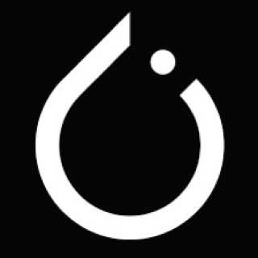

  <h1 style="background: linear-gradient(to right, black, white); -webkit-background-clip: text; -webkit-text-fill-color: transparent; margin: 0;">
        MyLLM
    </h1>
    

        
    

     
     
    

        
         
        
        
         
    

### LLM Framework | Toolkit for various training stages
Initially derived from [Effective LLM Alignment](https://github.com/VikhrModels/effective_llm_alignment/) by VikhrModels.  
Many credits goes to the Vikhr Team.
## 🚀 Methods and Stages supported:
- Supervised Finetuning (Full/LoRa/QLoRa)
- Distillation (KL Divergence, MSE, Cosine and others)
- Reinforcement Learning (GRPO, DPO, PPO) # Will be in the future
- Adapters merging
- Tokenizer extensions
## 🛠️ Technical details:
- Built on top of PyTorch, Transformers, TRL, Peft. No 'magic' libraries like unsloth.
- Distributed training via Accelerate, FSDP and DeepSpeed (Stage 2, 3).
- Acceleration with vLLM, FlashAttn, Liger Kernels and fusion.
- Logging options: wandb, clearml
- Convenient config management using TOML

> [!IMPORTANT]
> Please, feel free to contribute to the lib as it is in early development. Let's develop some useful models and tools together! My contacts are in my profile